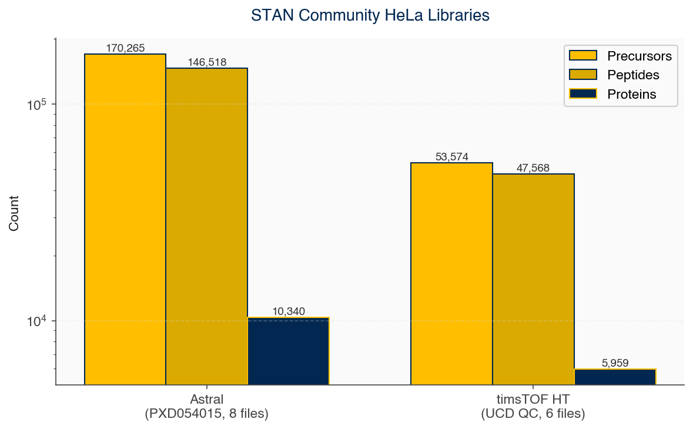
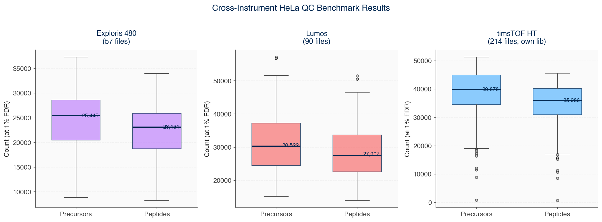
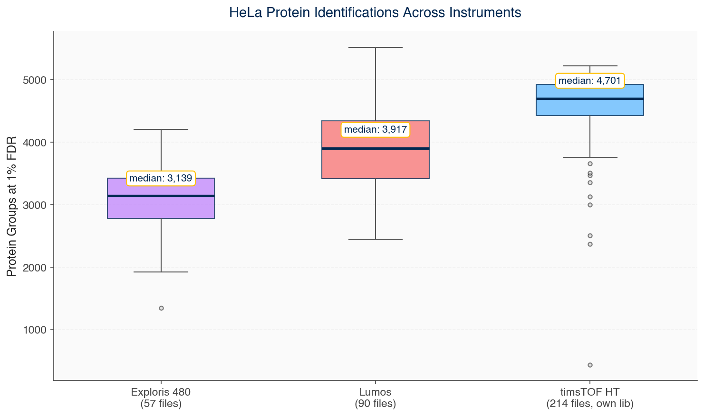
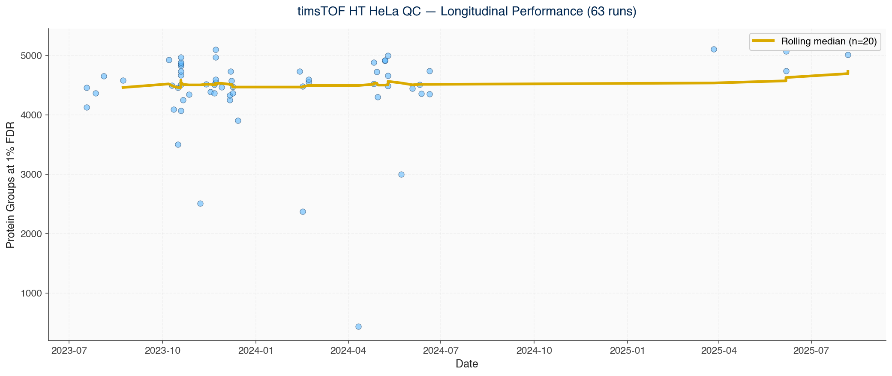

# STAN Community Benchmark — Library Build and Cross-Instrument Validation Report

**Date**: April 2026
**Author**: UC Davis Proteomics Core

## Summary

We built two HeLa spectral libraries for the STAN community benchmark and validated them across four different mass spectrometer platforms (Orbitrap Astral, Exploris 480, Fusion Lumos, and timsTOF HT). Both libraries transfer cleanly across instruments from the same vendor family. We have 214 longitudinal timsTOF HeLa QC runs spanning 2023-2025 that will seed the community reference ranges.

---

## 1. Library Building

Two empirical spectral libraries were built by library-free search against a reviewed human UniProt FASTA (including Cambridge contaminants). DIA-NN 2.3.0 was run in library-free mode (`--fasta-search --predictor --gen-spec-lib`) on the files listed below.

| Library | Input files | Precursors | Peptides | Proteins | File size |
|---------|-------------|------------|----------|----------|-----------|
| **Astral HeLa** | 8 files from [PXD054015](https://proteomecentral.proteomexchange.org/cgi/GetDataset?ID=PXD054015) (Van Eyk lab, Cedars-Sinai), 8/11/24/45 min gradients, 200 ng | **170,265** | 146,518 | 10,340 | 38 MB |
| **timsTOF HT HeLa** | 6 files from UC Davis longitudinal QC, 60/100 SPD, 50 ng | **53,574** | 46,200 | 5,959 | 12 MB |

The Astral library is ~3x larger than the timsTOF library because PXD054015 included diverse gradient lengths and DIA window schemes, whereas our timsTOF data is from a single consistent method.

---

## 2. Cross-Instrument Benchmark

To test whether libraries transfer across instruments in the same vendor family, we searched 361 total HeLa QC files from four instruments against the appropriate library.

| Instrument | Files | Library | Median Precursors | Median Peptides | Median Proteins |
|------------|-------|---------|-------------------|-----------------|-----------------|
| Exploris 480 | 57 | Astral (170K) | 25,445 | 23,131 | 3,139 |
| Lumos | 90 | Astral (170K) | 30,522 | 27,907 | 3,917 |
| timsTOF HT | 214 | timsTOF HT (54K) | 39,878 | 35,986 | 4,701 |

**Key findings:**

1. **The Astral-built library works for all Thermo Orbitrap platforms.** Both Exploris 480 and Lumos searched successfully against it. The library does not need to be built per-instrument — one Orbitrap library works across the family.
2. **Lumos outperforms Exploris 480 in these data** (3,917 vs 3,139 proteins). This is likely because the Lumos runs are longer (60 min vs 30 min typical) and the Lumos is a high-performing instrument despite being older.
3. **timsTOF gets more precursors per run than either Orbitrap** — consistent with the instrument's higher duty cycle through diaPASEF.
4. **Vendor-specific libraries are required.** The timsTOF library is smaller but captures ion mobility and TIMS-CID fragmentation, which the Orbitrap HCD-based Astral library does not.

---

## 3. Longitudinal timsTOF QC Data (2023-2025)

The 214 timsTOF HT files span multiple years of routine HeLa QC at UC Davis. This is an exceptional longitudinal dataset — most labs never capture this much history in a searchable form.

The rolling median protein count shows the instrument's performance over time. This data will seed the STAN community reference ranges, giving new users an immediate baseline against which to compare their own QC runs.

**Per-file statistics** (214 files):
- Precursors: median 39,878, range 847 – 51,318
- Peptides: median 35,986, range 805 – 45,561
- Proteins: median 4,701, range 438 – 5,215

The wide range (especially the minimum of 438 proteins) indicates some runs were failures. **This is exactly why STAN needs outlier detection** — any run with < 1000 proteins is clearly not a normal QC and should be flagged and excluded from the community benchmark baseline.

---

## 4. Search Performance

Search time for a single QC file against the Astral library (170K precursors) on Hive with 32 CPUs:

| File type | Typical time | Notes |
|-----------|--------------|-------|
| 30 min Exploris 480 | ~45 sec/file (amortized) | ~90s startup overhead |
| 60 min Lumos | ~70 sec/file (amortized) | |
| 8 min Astral narrow-window | ~25 sec/file | |

**For single-file QC runs in production** (STAN watcher mode), expect 2-5 minutes per search including library load and FASTA annotation. This is well within the acceptable range for real-time QC.

---

## 5. Conclusions

1. The Astral empirical library (170K precursors) is the right size — fast enough for QC, deep enough for meaningful coverage across Thermo Orbitrap instruments.
2. The timsTOF empirical library (54K precursors) serves all Bruker timsTOF platforms.
3. Both libraries will be frozen, hash-verified, and uploaded to the STAN community benchmark HF Dataset at `brettsp/stan-benchmark`.
4. The 214 longitudinal timsTOF runs will populate the initial community reference ranges, giving the benchmark real data from day one.
5. Outlier detection is essential — the timsTOF dataset already contains failed runs (438 proteins minimum) that must be excluded from baseline statistics.

---

## Files

- Astral library: `/quobyte/proteomics-grp/de-limp/downloads/PXD054015/astral_hela_lib/report-lib.parquet`
- timsTOF library: `/quobyte/proteomics-grp/hela_qcs/timstof_hela_lib/report-lib.parquet`
- Search results: `/quobyte/proteomics-grp/hela_qcs/search_results/`
